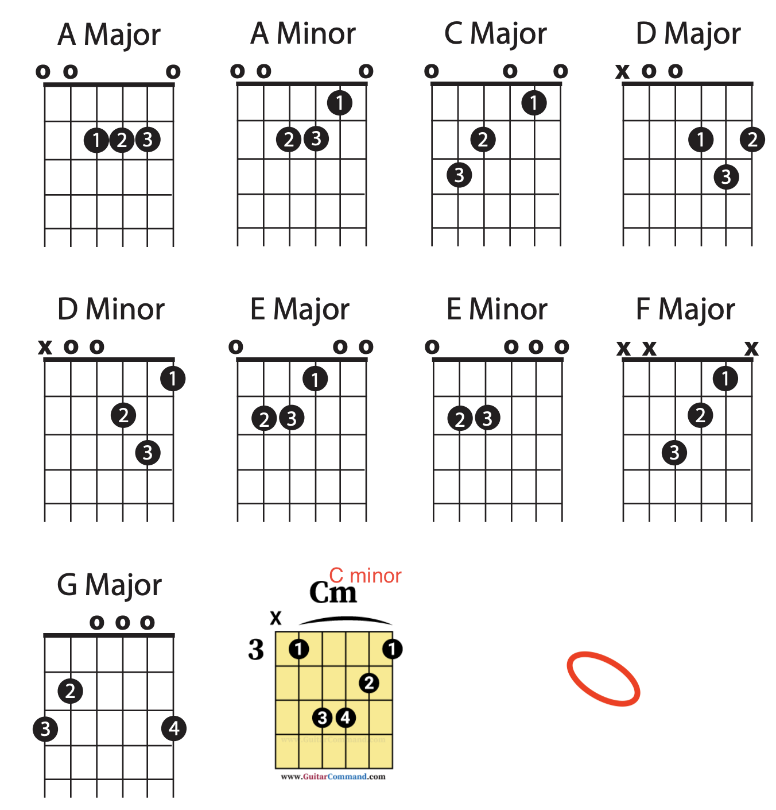

# TO BUY
  - 1st choice: used MIM strat/tele
  - 2nd choice: Highway1 strat
  - I’ve found local music shops much more honest and helpful than Guitar Center. I usually go to Starving Musician, but I think people love Gryphon in Palo Alto too

https://reverb.com/p/fender-custom-shop-danny-gatton-telecaster had diamonds on the side markers that were slightly raised 

# Notes
- Note wheel  
  

- diminished fifth: spans 6 semitones, such as C -> Gb
- perfect fifth(P5): spans 7 semitones, such as C -> G
- augmented fifth: spans 8 semitones, such as C -> G#
- minor seventh: spans 10 semitones, sucn as C -> A#
- major seventh: spans 11 semitones(C to B)   C -> (E) -(G) -> B

# Scales
- A diminished chord:  root + a minor 3rd + a diminished 5th. Cdim =  C, Eb + Gb
- A minor chord:       root + a minor 3rd + a perfect 5th. Cminor = C + Eb + G
- A major chord:       root + a major 3rd + a perfect 5th. Cmajor = C + E  + G
- Augmented Chord:     root + a major 3rd + a augmented 5th. C_aug/C+ = C + E + G#

- dominant seventh/major minor seventh chord: root + major third + perfect fifth + minor seventh
- power chord(C5): means the chord has 1st and 5th note from the scale. popular in rock

- Movable open Emaj/Emin, root at 6th string  
- Movale Cmajor, 3rd fret, 2/3/4 strings(postion 5), root at 5th string
  Movale Cminor, 3rd fret, 2(pos 4), 3/4 strings(postion 5), root at 5th string
  

- major pentatonic: 1, 2, 3, 5, and 6 of the major scale
- minor pentatonic: 1, 3, 4, 5, and 7 of the natural minor scale
- 
- 
- 1st popular chord progression is 1->4->5. For example for g major key, it is G(1) -> A(2) -> B(3) -> C(4) -> D(5). 1->4->5 would be G -> C -> D
- 2nd popular chord progression is 1->5->4. For example for g major key, it is G(1) -> A(2) -> B(3) -> C(4) -> D(5). 1->5->4 would be G -> D -> C
- 3rd progression is 1->6->2 or 4->5, found in songs from doo-wop era. For g major key, it is G(1) -> A(2) -> B(3) -> C(4) -> D(5) -> Emin(6). 1->6->2 or 4->5 would be G -> Emin -> A or C -> D
- 4th progression is 1->5->6->4, a very popular in broadway, hip songs, and rocks.
- 
- A triplet is three beats taking up the same space as two beats.
-
- down/up the fretboard means the pitches will go lower/higher; Across refers to taking the inversions from the higher-pitched strings to the lower-pitched strings.
-etude: 练习曲
-
- major chord -> minor chord: flat the 3rd

https://truefire.com/online-guitar-lessons

https://musicstudent101.com/episodes.html
https://www.oolimo.com/index.php
https://www.youtube.com/watch?v=XNhS2y9LyRo
https://source.apple.com/cupertino/en/content/657
https://youtube.com/playlist?list=PLB04Q_-DchOO2pfeUB7rT2imLd9jeOFzz

https://github.com/ShaobinTao/public/blob/master/c_maj.png?raw=true
https://github.com/ShaobinTao/public/blob/master/c_maj.png

http://visionguitar.com/
https://www.youtube.com/watch?v=ctx86V-GI8A
https://www.youtube.com/watch?v=sAeXskZHC2o&t=1201s
https://apps.apple.com/us/app/roxsyn-guitar-synthesizer/id1472450599
https://apogeedigital.com/products/jam
https://tonypolecastro.com/
http://justinguitar.com/
https://fretastic.com/guitar
https://istweb.apple.com/logic-pro-x    free
https://www.premierguitar.com/lessons/beginner/basic-chord-progressions
Gryphon Strings in Palo Alto
princeton reverb
https://source.apple.com/cupertino/en/content/679
https://prsguitars.com/electrics/model/se_pauls_guitar_2021
https://www.sweetwater.com/store/detail/SM57--shure-sm57-cardioid-dynamic-instrument-microphone
 Focusrite Scarlett 2i2  interface
 https://www.amazon.com/Behringer-UMC202HD-BEHRINGER-U-PHORIA-2-Channel/dp/B00QHURUBE/ref=sr_1_2?crid=3PIB7VO2R9FDQ&keywords=behringer%2Bumc202hd&qid=1646058368&sprefix=behringer%2Bumc202hd%2Caps%2C129&sr=8-2&th=1+
 https://www.sweetwater.com/insync/best-acoustic-guitars-under-1000/
https://www.audacityteam.org/
https://theacousticguitarist.com/
https://us.abrsm.org/en/  music exam

- Amplifier  
	Yamaha THR30iiA
	Boss Katana
	Fender (no recording)
	adorama (has apple discount)
  Spark
  
 

