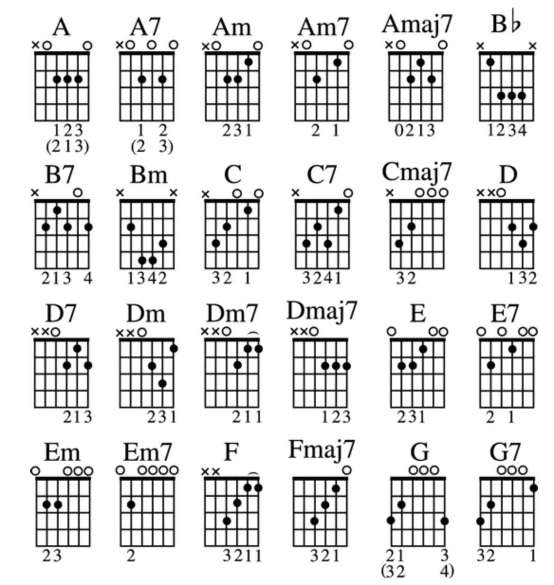

## Single Notes
- Note wheel   

- diminished fifth: spans 6 semitones, such as C -> Gb
- perfect fifth(P5): spans 7 semitones, such as C -> G
- augmented fifth: spans 8 semitones, such as C -> G#
- minor seventh: spans 10 semitones, sucn as C -> A#
- major seventh: spans 11 semitones(C to B)   C -> (E) -(G) -> B
- A triplet is three beats taking up the same space as two beats.

## Scales
- major pentatonic: 1, 2, 3, 5, and 6 of the major scale
- minor pentatonic: 1, 3, 4, 5, and 7 of the natural minor scale
- 

## Chords
- A diminished chord(dim):  root + a minor 3rd + a diminished 5th. Cdim =  C, Eb + Gb
- A minor chord(m):         root + a minor 3rd + a perfect 5th. Cminor = C + Eb + G
- A major chord:            root + a major 3rd + a perfect 5th. Cmajor = C + E  + G
- Augmented Chord(aug or +):root + a major 3rd + a augmented 5th. C_aug/C+ = C + E + G#

Table: Intervals  between Triad notes
| Root to third  | third to fifth | triad type |
| ------------- | ------------- | - |
| major 3rd  | minor 3rd  | major |
| minor 3rd  | major 3rd  | minor |
| major 3rd  | major 3rd  | Augmented |
| minor 3rd  | minor 3rd  | Diminished |
  
- power chord(C5): means the chord has only 1st and 5th note from the scale. popular in rock
- suspended chord(sus): usually(sus4)       root + perfect 4th + perfect 5th
  	                occasionally(sus2): root + major 2nd   + perfect 5th
- Sixths: C6 = Cmajor + A(the sixth note of the major scale)
- Seven types of Seventh
	- dominant seventh(C7): root + major 3rd + perfect 5th + flat 7th(a minor 3rd up from the 5th, Bb)
 	- major seventh(Cmaj7): root + major 3rd + perfect 5th + maj  7th(a major 3rd up from the 5th, B)
 	- minor seventh(Cmin7): root + minor 3rd + perfect 5th + flat 7th
 	- minor major seventh(Am(maj7)): root + minor 3rd + perfect 5th + maj 7th
	- aug seventh(D7#5):    root + major 3rd + aug 5th + flat 7th
 	- diminished 7th(dim7): root + minor 3rd + diminished 5th + flat flat 7th(6th)
 	- half diminished 7th(Am7(b5): root + minor 3rd + diminished 5th + flat 7th
  - Adding On(add9, add11)
  	- add9:			root + major 3rd + perfect 5th + major 9th
  	- add11:		root + major 3rd + perfect 5th + major 11th
  - Piling On
  	- any "9" chord:	root + major 3rd + perfect 5th + flat 7th + maj 9th
  	- any "maj9" chord:	root + major 3rd + perfect 5th + maj  7th + maj 9th
 	- C11:			C E G Bb D F
  - 
 
- ?? Movable open Emaj/Emin, root at 6th string  
- ?? Movale Cmajor, 3rd fret, 2/3/4 strings(postion 5), root at 5th string
- ?? Movale Cminor, 3rd fret, 2(pos 4), 3/4 strings(postion 5), root at 5th string

## Chord progression (by popularies)
- 1->4->5, For example for g major key, it is G(1) -> A(2) -> B(3) -> C(4) -> D(5). 1->4->5 would be G -> C -> D
- 1->5->4. For example for g major key, it is G(1) -> A(2) -> B(3) -> C(4) -> D(5). 1->5->4 would be G -> D -> C
- 1->6->2 or , found in songs from doo-wop era. For g major key, it is G(1) -> A(2) -> B(3) -> C(4) -> D(5) -> Emin(6). 1->6->2 or 4-- 4th progression is 1->5->6->4, a very popular in broadway, hip songs, and rocks.
>5 would be G -> Emin -> A or C -> D
- 2->5->1
- 3->6
- 4->5 or 4->1
- 5->1

## Gears
  - 1st choice: used MIM strat/tele
  - 2nd choice: Highway1 strat
  - I’ve found local music shops much more honest and helpful than Guitar Center. I usually go to Starving Musician, but I think people love Gryphon in Palo Alto too

https://reverb.com/p/fender-custom-shop-danny-gatton-telecaster had diamonds on the side markers that were slightly raised 

- Amplifier  
	Yamaha THR30iiA
	Boss Katana
	Fender (no recording)
	adorama (has apple discount)

## Vacabularies
- barre chord: closed/movable chord(封闭和弦);  barre(ballet daner的扶手）
	- E-shaped barre chord, such as C at 8th fret
 	- A-shaped barre chord, such as C at 3fr
- 
- down/up the fretboard means the pitches will go lower/higher;
- Across refers to taking the inversions from the higher-pitched strings to the lower-pitched strings.
- Diatonic: 全音阶
- Diatonic chord: chords formed with the notes of a single major scale. For example, in the key of C major, F maj(F-A-C) and Emin(E-G-B) would be diatonic to that key. But Dmaj(D-F#-A) is not since F# is not a note of the C maj scale.

For Key C major, all its diatonic chords would be (roman numbers in the left col means degrees of the diatonic chords)
 

 
Noted pattern: i/iv/v are always major chord; iii/vi are always minor; vii will always be diminished. 

Based on above approach, all diatonic chords for all keys are(totally 12 signatures/rows)
 

 
If somebody tell you to play a blues song in key D, likely the song would probably just have D-G-A(1->4->5 progression)

- etude: 练习曲
- Open chord/open-position chord/cowboy chord
 

 
- riff: improvisation
- tonic: root/first note of any scale
- transpose songs: change the notes/chords from one key to another.

  
## Web References

https://truefire.com/online-guitar-lessons

https://musicstudent101.com/episodes.html
https://www.oolimo.com/index.php
https://www.youtube.com/watch?v=XNhS2y9LyRo
https://source.apple.com/cupertino/en/content/657
https://youtube.com/playlist?list=PLB04Q_-DchOO2pfeUB7rT2imLd9jeOFzz

https://github.com/ShaobinTao/public/blob/master/c_maj.png?raw=true
https://github.com/ShaobinTao/public/blob/master/c_maj.png

http://visionguitar.com/
https://www.youtube.com/watch?v=ctx86V-GI8A
https://www.youtube.com/watch?v=sAeXskZHC2o&t=1201s
https://apps.apple.com/us/app/roxsyn-guitar-synthesizer/id1472450599
https://apogeedigital.com/products/jam
https://tonypolecastro.com/
http://justinguitar.com/
https://fretastic.com/guitar
https://istweb.apple.com/logic-pro-x    free
https://www.premierguitar.com/lessons/beginner/basic-chord-progressions
Gryphon Strings in Palo Alto
princeton reverb
https://source.apple.com/cupertino/en/content/679
https://prsguitars.com/electrics/model/se_pauls_guitar_2021
https://www.sweetwater.com/store/detail/SM57--shure-sm57-cardioid-dynamic-instrument-microphone
 Focusrite Scarlett 2i2  interface
 https://www.amazon.com/Behringer-UMC202HD-BEHRINGER-U-PHORIA-2-Channel/dp/B00QHURUBE/ref=sr_1_2?crid=3PIB7VO2R9FDQ&keywords=behringer%2Bumc202hd&qid=1646058368&sprefix=behringer%2Bumc202hd%2Caps%2C129&sr=8-2&th=1+
 https://www.sweetwater.com/insync/best-acoustic-guitars-under-1000/
https://www.audacityteam.org/
https://theacousticguitarist.com/
https://us.abrsm.org/en/  music exam

 

